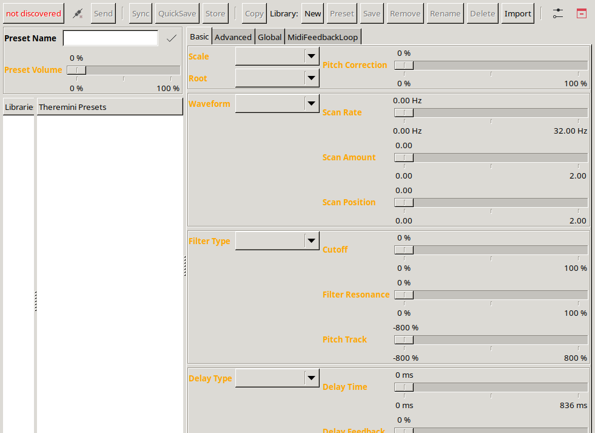

# ThereMaxi

Linux editor and preset librarian for the Moog Theremini, written in Perl 5 with GTK2.
Original code © 2017 Peter Niebling, GPL-3.0 (see `LICENSE`).

*Moog is a registered trademark of Moog Music Inc. Theremini is a trademark of Moog Music Inc.
This project is not affiliated with Moog Music Inc.*



It connects to the Theremini over ALSA MIDI and lets you

* edit every preset parameter from a desktop UI, optionally live (**sync on change** — edits are pushed to the device as you move a slider),
* pull all presets off the device (**Sync**) and keep them in local libraries as JSON,
* import Moog's `.theremini` library files,
* map the pitch/volume antennas onto arbitrary parameters (**MidiFeedbackLoop** tab) — play the filter with your hand.

## Status

The code is from 2017/2018 and was written for perl 5.22. It has been made to run again on
current Ubuntu (tested on **Ubuntu 26.10, perl 5.40.1, GTK 2.24.33**); see
[Changes for modern perl](#changes-for-modern-perl) below. The GUI comes up and all non-MIDI code
paths (preset decode, library round-trip, value export) run warning-free. Device communication
itself has *not* been re-tested against real hardware since the port — if you have a Theremini,
reports are welcome.

## Installing the dependencies (Ubuntu / Debian)

ThereMaxi needs `File::Pid`, `Getopt::Long`, `Gtk2`, `JSON::PP`, `MIDI::ALSA`, `MIME::Base64` and
`sigtrap`. Everything except `Gtk2` is either core perl or packaged:

```sh
sudo apt install build-essential pkg-config libcrypt-dev \
                 libgtk2.0-dev libglib-perl libcairo-perl libpango-perl \
                 libextutils-depends-perl libextutils-pkgconfig-perl \
                 libfile-pid-perl libmidi-alsa-perl
```

`libcrypt-dev` is easy to miss: without `crypt.h` every perl XS build fails with
`fatal error: crypt.h: No such file or directory`.

### Gtk2

The perl GTK2 bindings have been dropped from recent Ubuntu releases. Check first:

```sh
apt-cache policy libgtk2-perl
```

If that prints a candidate version, `sudo apt install libgtk2-perl` and you are done. If it prints
`Candidate: (none)` — as on Ubuntu 26.10 — build the module from CPAN. The GTK2 *C* library is still
packaged (`libgtk2.0-dev` above), so only the bindings need compiling:

```sh
curl -LO https://cpan.metacpan.org/authors/id/X/XA/XAOC/Gtk2-1.24993.tar.gz
tar xzf Gtk2-1.24993.tar.gz
cd Gtk2-1.24993
perl Makefile.PL
make CCFLAGS="$(perl -MConfig -e 'print $Config{ccflags}') \
              -Wno-incompatible-pointer-types -Wno-implicit-function-declaration"
sudo make install
```

The two `-Wno-` flags are the whole trick: GCC 14 turns incompatible pointer types into an error, and
`xs/GtkItemFactory.xs` assigns a typed callback to `GtkItemFactoryCallback` (`void (*)(void)`).
That is legal for this API, so downgrading it back to a warning is safe. Plain `cpan Gtk2` fails
without them.

To keep it out of the system perl directories, install into a prefix instead:

```sh
perl Makefile.PL INSTALL_BASE=$HOME/perl5
make CCFLAGS="$(perl -MConfig -e 'print $Config{ccflags}') \
              -Wno-incompatible-pointer-types -Wno-implicit-function-declaration"
make install
export PERL5LIB=$HOME/perl5/lib/perl5
```

## Running

```sh
./ThereMaxi.pl
```

The shebang is `#!/usr/bin/perl -w`; adjust it if your perl lives elsewhere. Options:

| Option | Meaning |
| --- | --- |
| `--statefile=<file>` | where window geometry, preferences and the selected preset are stored (default `./ThereMaxi.state`) |
| `--pidfile=<file>` | default `$XDG_RUNTIME_DIR/ThereMaxi.pid`, else next to the script |
| `--cleanstate` | start from defaults, ignoring the state file |

Preset libraries are JSON files (`*.theremaxi`) in the library directory, `./data` by default,
changeable under **Preferences → General**. The presets read off the device live in the hidden
`.theremaxi` file there and show up as *Theremini Presets*.

Plug in the Theremini over USB before or after starting — the toolbar button on the left shows
`not discovered` until an ALSA client whose name matches `theremini` appears. Check with:

```sh
aconnect -l
```

If discovery finds nothing although the device is listed, disable **Preferences → Device →
Automatic Discovery** and use the connect button in the toolbar.

## Hacking

`t/check.sh` runs everything that can be checked without a Theremini, a display or non-core perl
modules — a smoke test that loads the whole non-GUI tree and exercises preset decoding, value
export and the library round-trip, syntax checks, and a drift check on the generated protocol
data. CI runs it on every push, and again before publishing a release.

`protocol/tables.json` and `protocol/golden.json` are generated by `tools/dump-protocol.pl` from
the tables in `lib/`: what the parameters are, and what this code does with them. They are the
contract a reimplementation is tested against — see `DESIGN.md`. `CLAUDE.md` has an architecture
overview of the perl code.

## Troubleshooting

**`Gtk-Message: Failed to load module "atk-bridge"` / `"appmenu-gtk-module"`** — harmless noise from
GTK2 accessibility modules that no longer match the installed GTK. Silence with `NO_AT_BRIDGE=1`.

**`Can't locate Gtk2.pm`** although you installed it into a prefix — set `PERL5LIB` (see above).

**`ThereMaxi is running`** — a stale pidfile from a crash; delete
`$XDG_RUNTIME_DIR/ThereMaxi.pid`.

**Numbers show a comma instead of a dot** — a known locale issue the original author worked around
in several places (`tr/,/./`). If a value refuses to convert, start with `LC_NUMERIC=C`.

## Changes for modern perl

Two changes were needed to run on perl ≥ 5.36; both are in the repository:

* `ThereMaxi.pl` — `File::Pid->running` calls `kill(0, undef)` when no pidfile exists yet, which
  became a fatal error (*"Can't kill a non-numeric process ID"*). The call is now wrapped in `eval`:
  no pidfile means not running.
* `lib/Controller.pm` — `bless {}, "$base::$self"` interpolated as the variable `${base::}` followed
  by `$self`, so every controller was blessed into a bogus package (*"Can't locate object method
  "define" via package "\_085""*). Now built by concatenation.

## Roadmap

A rewrite in Rust with wxWidgets has been floated. Recommended order:

1. **Keep the Perl version running** (done) — it is the reference implementation and the only
   documentation of the sysex format.
2. **Capture the protocol as data.** The valuable, hard-to-recreate parts are the CC table in
   `lib/Controller.pm`, the sysex offset table `%IMPORT` in `lib/Preset.pm`, the 7-bit unpacking in
   `Preset::_sx_`, and the per-parameter scaling in the `value_import`/`value_export` methods. Port
   those first, with tests against real `.theremini` files and captured dumps.
3. **Then the GUI.** The Perl side is thin: an event bus (`lib/Event.pm`), a widget per controller
   type, and a layout that is mostly a list of CC numbers. Note that `wxWidgets` bindings for Rust
   are less mature than `gtk-rs`; if wx is a hard requirement, a wxPerl intermediate step is possible
   since `libwx-perl` is packaged in Ubuntu — but it doubles the work.

See `CLAUDE.md` for an architecture overview of the existing code.

## History

The original release notes (`README`):

* **17/10/19** — first release.
* **17/10/23** — workaround for the locale problem in numeric controllers; better MIDI handling;
  `MidiFeedbackLoop` feature added (use input from the antennas to manipulate preset controllers);
  fixed import routine.
* **17/10/27** — fixed low/high note range; 14-bit support for controller input.
* **18/04/13** — fixed comma in numeric values; fixed some undefs.
* **26/07/23** — runs on current perl/Ubuntu again (see above).
