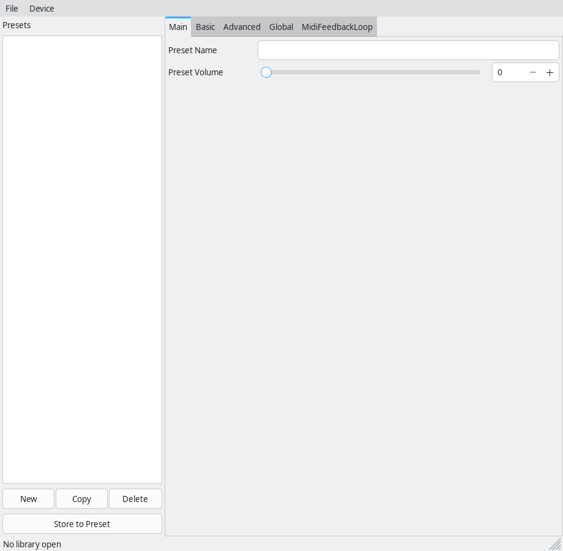

# ThereMaxi

Editor, preset librarian and LV2 plugin for the Moog Theremini, on Linux.

*Moog is a registered trademark of Moog Music Inc. Theremini is a trademark of Moog Music Inc.
This project is not affiliated with Moog Music Inc.*



There are two implementations in this repository:

* **The application** — a **wxWidgets** editor and librarian (`theremaxi-gui`), built on two small C
  libraries (`libtheremini-protocol` and `libtheremini-device`), with a UI-less **LV2 plugin** and a
  command-line tool (`theremini-probe`) alongside. This is the active rebuild, in C and C++, and it
  has been validated against a real Theremini (firmware 1.1.1).
* **The reference** — the original **Perl / GTK2** program (`ThereMaxi.pl`) by Peter Niebling, 2017,
  kept running as the reference implementation of the device's protocol. The C code is generated
  from and tested against it. GPL-3.0-or-later (see `LICENSE`).

## What it does

* Edit every preset parameter — a slider paired with a spin control for numbers, a dropdown for the
  enumerated ones, laid out from the parameter table.
* Manage `.theremaxi` preset libraries — open and save, and create, copy and delete presets. The
  file format is interchangeable with the Perl app.
* Talk to the device — connect and read the firmware, sync all 32 presets off it, send the current
  settings to a slot, auto-detect the MIDI channel, and watch the antennas live in the status bar.
* **MidiFeedbackLoop** — drive preset parameters from the live antenna movement (play the filter
  with your hand).
* **LV2 plugin** — exposes the parameters as control ports so a host such as Ardour can automate the
  device from its timeline; it emits the matching MIDI, with no UI of its own.

## Building the application

On Ubuntu / Debian:

```sh
sudo apt install build-essential cmake perl \
                 libasound2-dev libwxgtk3.2-dev lv2-dev sordi
# optional: doxygen for the API docs
```

```sh
cmake -S . -B build
cmake --build build
ctest --test-dir build          # runs the test suite
```

Everything optional builds only when its dependency is found: the wx application needs wxWidgets,
the device transport and the probe tool need ALSA, the LV2 plugin needs `lv2` (and `sordi` to
validate it). Perl is needed at build time — it generates the C tables from `protocol/tables.json` —
but the built binaries do not depend on it.

## Running

**The editor:**

```sh
./build/theremaxi-gui                       # offline
./build/theremaxi-gui my-library.theremaxi  # open a library
```

Use **File** to open and save libraries and manage presets, and **Device** to connect, sync presets
from the Theremini, send the current settings to a slot, or auto-detect the channel. **Preferences**
holds the MIDI input configuration.

**The command-line tool** drives the device without the UI:

```sh
./build/theremini-probe               # discover and identify
./build/theremini-probe --dump        # fetch the presets and report the count
./build/theremini-probe --channel     # auto-detect the antenna channel
./build/theremini-probe --backup FILE # save the preset dump (see below)
```

**The LV2 plugin:** copy `build/theremini.lv2` into `~/.lv2/` (or install with
`cmake --install build`), and it appears in any LV2 host.

The Theremini shows up as an ALSA sequencer client named *Moog Theremini*; check with `aconnect -l`.

## Back up before you write

Writing to the device changes its stored presets. Take a restore point first:

```sh
./build/theremini-probe --backup ~/theremini-factory.syx
```

## Known device limitations (firmware 1.1.1)

Found while validating against the hardware:

* The **effect name** (the "Long Delay" label) is a stored string the documented protocol does not
  let us set — the effect-name sysex is a no-op, though the identical preset-name sysex works. A
  written preset keeps its delay behaviour but loses that label.
* A couple of parameters round-trip within about one 7-bit step; that is the resolution of a MIDI
  control-change and cannot be helped.
* There are no hidden preset slots beyond the 32 — a program change past 31 wraps back into them.

## How it is built and tested

Everything derives from one source of truth: `protocol/tables.json`, generated from the Perl tables.
From it, the build generates the C parameter table, the LV2 port description and a set of golden
vectors — the values the Perl produces for decoding dumps and putting values on the wire. The C code
is tested by replaying those vectors, so it cannot drift from the reference. On top of that the
`.theremaxi` parser is fuzzed, everything runs clean under AddressSanitizer and UBSan, the public
API is documented with Doxygen, and CI checks it all on every push.

`DESIGN.md` explains the architecture and the test strategy; `CLAUDE.md` is an overview of the Perl
reference.

## The Perl reference implementation

`ThereMaxi.pl` is the original 2017 application. It still runs, and remains the reference for the
protocol. It needs `File::Pid`, `Getopt::Long`, `Gtk2`, `JSON::PP`, `MIDI::ALSA`, `MIME::Base64` and
`sigtrap`.

```sh
sudo apt install build-essential pkg-config libcrypt-dev \
                 libgtk2.0-dev libglib-perl libcairo-perl libpango-perl \
                 libextutils-depends-perl libextutils-pkgconfig-perl \
                 libfile-pid-perl libmidi-alsa-perl
./ThereMaxi.pl
```

`libcrypt-dev` is easy to miss: without `crypt.h` every Perl XS build fails with
`fatal error: crypt.h: No such file or directory`.

### Gtk2

The Perl GTK2 bindings have been dropped from recent Ubuntu releases (`apt-cache policy
libgtk2-perl`). Where there is no candidate, build the module from CPAN — the GTK2 *C* library is
still packaged, so only the bindings compile:

```sh
curl -LO https://cpan.metacpan.org/authors/id/X/XA/XAOC/Gtk2-1.24993.tar.gz
tar xzf Gtk2-1.24993.tar.gz && cd Gtk2-1.24993
perl Makefile.PL
make CCFLAGS="$(perl -MConfig -e 'print $Config{ccflags}') \
              -Wno-incompatible-pointer-types -Wno-implicit-function-declaration"
sudo make install
```

The two `-Wno-` flags are the trick: GCC 14 turns incompatible pointer types into an error, and
`xs/GtkItemFactory.xs` assigns a typed callback to `GtkItemFactoryCallback`, which is legal for that
API. Install into `INSTALL_BASE=$HOME/perl5` and set `PERL5LIB` to keep it out of the system tree.

`t/check.sh` runs the reference's checks — a smoke test of the non-GUI code, syntax checks, and the
drift check on the generated tables — with nothing but core Perl.

### Running notes

The shebang is `#!/usr/bin/perl -w`; adjust it if your Perl lives elsewhere. Options: `--statefile`,
`--pidfile`, `--cleanstate`. Preset libraries are the same `.theremaxi` JSON files the C application
uses. A stale `$XDG_RUNTIME_DIR/ThereMaxi.pid` after a crash gives *"ThereMaxi is running"* — delete
it. The GTK accessibility-module warnings on start are harmless (`NO_AT_BRIDGE=1` silences them).

### Fixes for modern Perl

Two changes let it run on Perl ≥ 5.36: `File::Pid->running` called `kill(0, undef)` on a missing
pidfile (now guarded), and `bless {}, "$base::$self"` interpolated as `${base::}` (now concatenated).

## History

* **2017-10-19** — first release of ThereMaxi by Peter Niebling.
* **2017-10-23** — locale workaround; better MIDI handling; the MidiFeedbackLoop feature; import fix.
* **2017-10-27** — low/high note range fixed; 14-bit controller input.
* **2018-04-13** — comma in numeric values fixed; some undefs fixed.
* **2026-07** — runs on current Perl/Ubuntu again; the C/wxWidgets rebuild, the LV2 plugin and the
  device libraries, all validated against real hardware.
